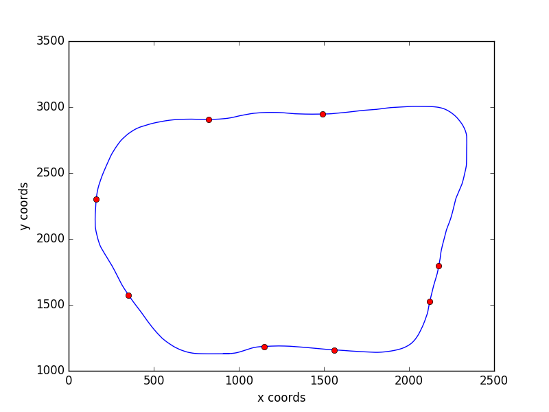
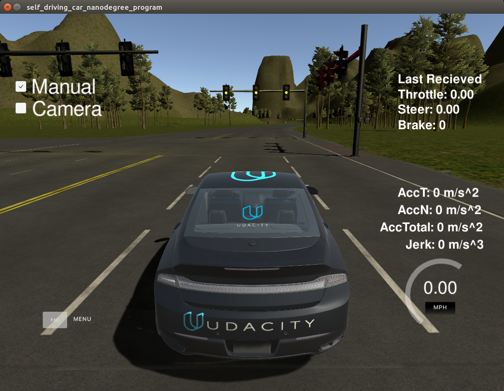
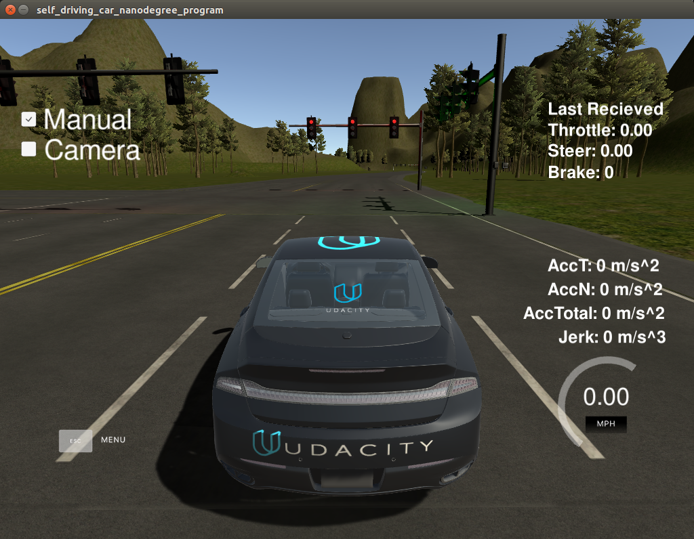
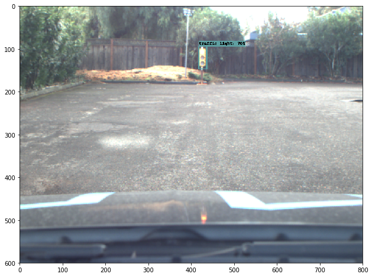
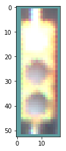
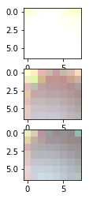

# CarND CAPSTONE

## Project Overview

This is the final project for the Self Driving Car Engineer Nano degree that brings together everything covered over the course of this program. Here we get to explore a real life example that combines computer vision, sensor fusion, and path planning to allow a vehicle to navigate through its environment while obeying traffic lights and obstacles. We borrow concepts learned from previous projects to publish waypoints ahead of the vehicle to indicate the desired path to follow and use neural networks to classify images and predict the state of a traffic light for our path planning controller. The initial project is built and tested on the Unity simulator provided by Udacity which gets uploaded to Carla once approved!

## Getting Started

View the project outline and how to download and bringup the source code from the repository [here](https://github.com/djiglesias/CarND-Capstone/blob/devel/INSTALL.md). Once downloaded, the following commands can be run to compile the application.

    $ git clone https://github.com/djiglesias/CarND-Capstone.git
    $ cd ros
    $ catkin_make
    $ source devel/setup.sh
    $ roslaunch launch/styx.launch
 
 Open the term 3 simulator, which can be downloaded [here](https://github.com/udacity/CarND-Capstone/releases), then disable the manual driving icon and enable the camera for traffic light updates to be sent to the path planning controller!

 

## Building the ROS Nodes

### Waypoint Updated (Partial)

The first step of the project is to get the ROS controller to publish a sample of waypoints ahead of the car to display the desired trajectory to follow. When the simulator first launches it publishes all the waypoints related to the respective track to `/base_waypoints`, this topic operates as a latch so it is only published once to reduce the amount of processing required during runtime (there are approximately 11,000 waypoints). Additionally, there are eight traffic lights on the simulator track where the location of the stopline is hardcoded via the `sim_traffic_light.config` yaml file loaded upon launch. A helpful walk through for this section is [HERE](https://www.youtube.com/watch?v=6GIFyUzhaQo).

The track is relatively simple as shown below by the blue line with the traffic lights shown as red dots. However, this section only displays the leading N waypoints ahead of the car since there is no data related to the traffic lights. The output of this node publishes the list of leading waypoinys ahead of the car to `/final_waypoints` which is used by the next section for controlling the car via DBW.

 

### Drive-By-Wire Controller

Once the Waypoint Updater node is publishing a list N leading waypoints to `/final_waypoints` the drive-by-wire node can be built to adjust the pose of the car with repsect to the next waypoint in the list. Following the project section walkthrough [HERE](https://www.youtube.com/watch?v=kdfXo6atphY) explains the implementation of a PID controller with the Yaw Controller for generating smooth movements between frames that adhere to the jerk restraints imposed on this project. Providing the controllers with the parameters of the vehicle in the simulator allows for the computation of an appropriate braking force per wheel since torque is just a perpendicual force applied at a distance from an origin... or the radius of a wheel multiplied by the force of the car (mass and desired acceleration).

The output of the yaw controller are commands for controlling three import aspects of the vehicle: steering, throttle, and brake. These are published to `/vehicle/steering_cmd`, `/vehicle/throttle_cmd`, and `/vehicle/brake_cmd` respectively that are handled by a third party controller.

### Traffic Light Detector

The Waypoint Updater (partial) and DBW nodes allow the vehicle to successfully drive around the track, but there is no regard to track lights... red lights are merely bad suggestions in this case. The project walkthrough [HERE](https://www.youtube.com/watch?v=oTfArPhstQU) demonstrates how to subscribe to `/vehicle/traffic_lights` to read data regarding updated traffic light states. When running on the simulator the states of the lights can simply be read from the simulator directly, however this will not be the case in real life. For development purposes, the states of the lights were used.

This node subscribes to `/current_pose` which provides the current position (x,y) of the vehicle on the track which is used to search for the closest leading traffic light on the track. Once the traffic light is found the index of that light is published to `/traffic_waypoint` which indicates the next traffic light needed by the Waypoint Updater node. 

 
 
 

### Waypoint Updater (Full)

The final step is to add the logic for obeying the traffic lights where red indicates that the vehicle needs to come to a complete stop at the stop line into the intersection. The project walkthrough [HERE](https://www.youtube.com/watch?v=2tDrj8KjIL4) demonstrates how to manipulate the `final_waypoints` topic being published so that the DWB node acts as desired. Functions were added to the previous version that calculate the distance to the next traffic waypoint and a deceleration function for bringing the car to a rest so that the front bumper is in line with the intersection stop line.

In the event that a traffic light is green, the simulator will proceed as before and maintain speed (or reset speed if starting from rest), however, if the traffic light is yellow or red then the deceleration function is called to recalculate the `final_waypoints` topic being published to adhere to the current trajectory in a slowing order where the last waypoint lays just behind the intersection stop line.

### Run Simulator

This program is rather computation intensive resulting in generic laptops and PCs struggling to keep up with the flow of data between the ROS nodes and the Unity simulator. Here are some tweaks that we made to the project to help run on "normal" people computers:

- `respawn="true"` was added to the launch files to restart nodes that were likely to fail during runtime so that the vehicle would keep driving around the track rather than off the road

- the length of leading waypoints being published and rendered as green dots was reduced from 200 points to 30 points to reduce the length of data being published through the ROS topics

- during runtime in automonmous mode the zoom was maxed in on car and pointed at road to limit rendering of background features in the distance

- the incoming `/image_color` topic published 800x800 images from the vehicle was throttled from 10 Hz to 2 Hz to reduce the amount of processing happening under the hood

- running the simulator with screen resolution at 640x480 and the graphics quality as fastest provided the best result for reducing the required rendering by the computer

## Traffic Light Classifier

This program can be divided into two steps.

- Identify the traffic light in the image: In this step the tensorflow object detection API is used to identify the location of traffic light in the sequence of images published by simulator. Several models from the API were tried and the `rfcn_resnet101_coco_2018_01_28` model seems to give accurate prediction of the traffic light with reasonable size of the model. The classifier is initialized by combining the chunks into a model protobuf file. Chunks were made as the actual model size is still too big to upload in Github. The `get_classification` method runs the tensorflow model on the images received from simulator and detects the location of traffic light if any. If the traffic light is not found then the state is assumed to be unknown. And when the valid traffic light is detected it is passed on to the `red_yellow_green` method for classification of traffic light. Left image shown below is an example output of detected traffic light. 

- Classify the state of the traffic light: If the traffic light is detected then the bounding boxes detected by API is used to crop the image only where the traffic light is seen as shown in the middle image below. The approach used to classify traffic light is simple but mostly accurate. The algorithm relies on the fact that the light when switched on has significant higher brightness than when switched off. The HSV (Hue-Saturation-Value a.k.a.(Brightness)) colorspace can be used to detect the brightness. The cropped image is further split into three 1/3rd size images to calculate the brightness and then compared with overall brightness. The highest ratio decides whether the light was red / yellow or green. In the example image below the split of brightness was following:

| Red | Yellow | Green |
|-----|--------|-------|
| 40% | 32%    | 28%   |

Hence, the algorithm classified that the traffic light is red. The assumption is that the red light is the topmost/rightmost light in the traffic light box.

 
 
 

## Track Test

... coming soon!